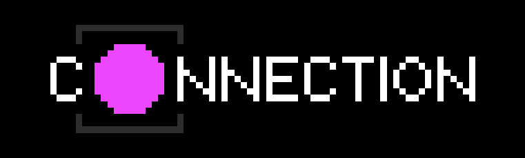
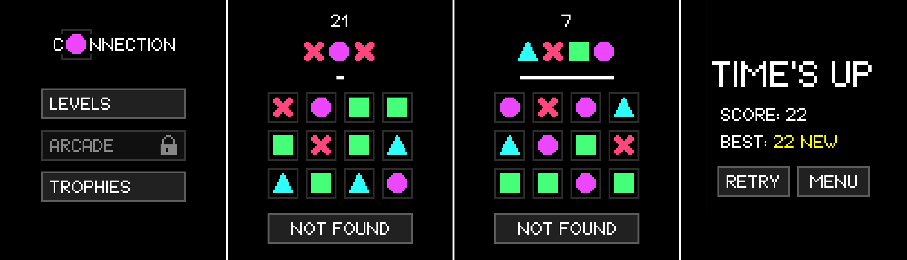
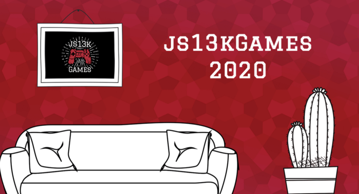
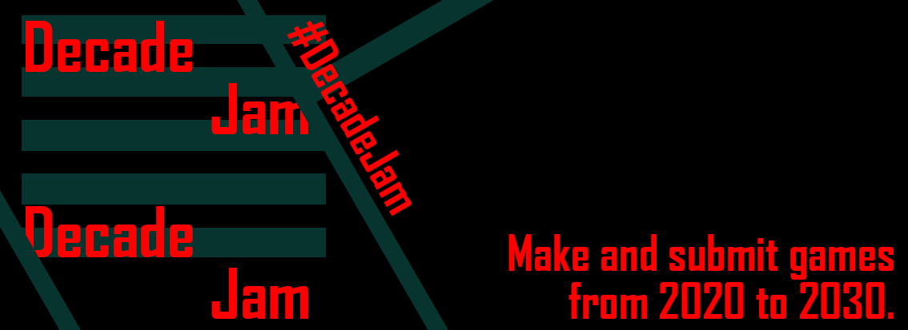

> A HTML5 puzzle game in less than 13KBs. Submitted to the js13kgames 2020 competition. This year's theme: 404.

Connection is a pattern-based puzzle game.

Connect the tiles on the board with your finger/mouse to replicate the given combination or press the "not found" button.

Play through the levels to unlock the arcade mode and ultimately achieve the final trophy.

## Gallery

## Submitted to

https://js13kgames.com/entries/connection

---

https://itch.io/jam/decadejam/rate/743475
